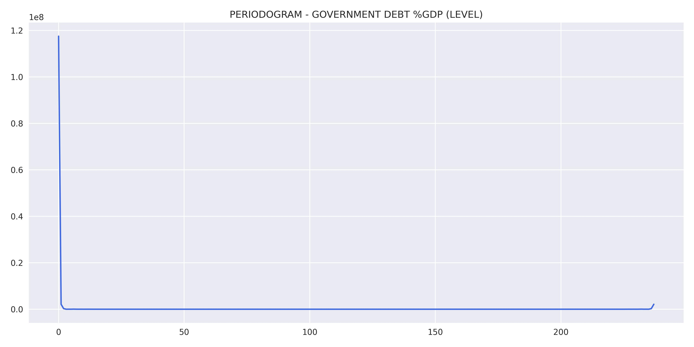

# **DESCRIPTION**
NET GENERAL GOVERNMENT DEBT (% GDP)

The Net Debt of the General Government corresponds to the net indebtedness (balance of debts and credits) of the Federal Government (including Social Security), state and municipal governments, with the public and private financial system, non-financial private sector and the rest of the world.

Source: Banco Central do Brasil – Departamento Econômico

link: https://www3.bcb.gov.br/sgspub/consultarmetadados/consultarMetadadosSeries.do?method=consultarMetadadosSeriesInternet&hdOidSerieSelecionada=4536

# **RESULTS**
Results obtained through the model estimation process.

## Variable analysis at level:
    

    

    

    

## Study of data stationarity:
    

    

## SEASONAL ADJUSTMENT:
    

    

## Model results:
    

## Residual analysis:
    

    

    

# FORECAST:
    
